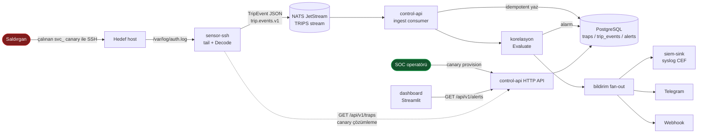

# Göktürk Deception Mesh

MVP v0.1 — bkz. [PROJECT PLAN.md](PROJECT%20PLAN.md) (görev dökümü, mimari, DoD).

**Tek cümlelik hedef:** Bir güvenlik ekibi bir _credential canary_ (honeytoken) eker; bir
saldırgan onu kullanır; saniyeler içinde SOC panelinde ve SIEM'de **sıfır-false-positive**,
yüksek-kesinlikli bir alarm belirir — hepsi air-gapped, `docker compose up` ile ayağa kalkan
bir yığın üzerinde.

Tehdit modeli ve çerçeve eşlemesinin ayrıntısı: [docs/THREAT_MODEL.md](docs/THREAT_MODEL.md).
(Demo GIF: canlı `docker compose up` akışından çekilecek — DoD adımı.)

## Mimari

Modüler monolit (`control-api`: ingestion + korelasyon + alarm + HTTP API tek binary) +
bağımsız `sensor-ssh`; olay veriyolu NATS JetStream. Uçtan uca akış:



| Bileşen | Sahip | Sorumluluk |
|---|---|---|
| `sensor-ssh` | Cyber | `auth.log` tailer → `ParseAuthLine` → `Decode`; yalnızca bilinen canary → `TripEvent` publish (canary değilse `ErrNotATrip`, hiçbir şey yayınlanmaz) |
| `control-api` | Cyber | Tuzak provisioning API + `trip.events.v1` ingestion + korelasyon + alarm persist + fan-out |
| `nats` | DevOps | JetStream veriyolu (`TRIPS` stream, `trip.events.v1`) |
| `postgres` | DevOps | `traps` / `trip_events` / `alerts` |
| `dashboard` | Cyber | Streamlit SOC paneli, `GET /api/v1/alerts` besleme |
| `siem-sink` | DevOps | Demo syslog CEF alıcısı |

**Sıfır-FP by construction:** korelasyonda bilinçli olarak ML/anomali yoktur; alarm yalnızca
_kesin bir canary eşleşmesinden_ (`Decode` → bilinen `trap_id`) doğar. Kural: tek trip → **High**,
aynı kaynaktan ≥2 trip → tek **Critical** (kampanya birleşmesi).

## Geliştirme

```sh
cp deployments/docker/.env.example deployments/docker/.env   # değerleri doldur
make build
make test
make lint
```

## Stack'i ayağa kaldırma

```sh
make docker-up
```

Servisler: `control-api`, `sensor-ssh`, `nats`, `postgres`, `dashboard`, `siem-sink`.
Detay için [deployments/docker/docker-compose.yml](deployments/docker/docker-compose.yml).

> `make docker-up` altı servisi de ayağa kaldırır: `nats` + `postgres` + `siem-sink` +
> `control-api` + `dashboard` + `sensor-ssh`.
> Panel: http://localhost:8501 — `GET /api/v1/alerts`'i 3 sn'de bir çeker.
> `sensor-ssh`, `/var/log/auth.log`'u salt-okunur bağlar (Debian/Ubuntu formatı varsayılır).

### Demo akışı (DoD)

```sh
# 1) Bir canary provision et — dönen "username" svc_ ile başlar, "secret" bir kez döner
curl -s -XPOST http://localhost:8080/api/v1/traps | tee /tmp/canary.json

# 2) O kullanıcı adıyla sahte bir SSH login satırını auth.log'a düşür (attacker simülasyonu)
U=$(jq -r .username /tmp/canary.json)
logger -p auth.info "sshd[1]: Failed password for $U from 203.0.113.7 port 40012 ssh2"

# 3) ≤5 sn içinde panelde High alarm + siem-sink'te CEF kaydı
docker compose -f deployments/docker/docker-compose.yml logs siem-sink
```

Canary olmayan bir kullanıcıyla login → **hiçbir alarm yok** (sıfır-FP kanıtı).

## Migration'lar

```sh
make migrate-up
make migrate-down
```

Şema taslak — bkz. [migrations/00001_init.sql](migrations/00001_init.sql) başındaki not.

## Branch & PR kuralları

`main` korumalı:
- Direkt push yok (repo sahibi dahil) — her değişiklik PR ile gelir.
- Merge öncesi tüm zorunlu CI kontrolleri yeşil olmalı: `Build, vet, test`, `golangci-lint`,
  `Docker build (control-api)`, `Dashboard tests (pytest)`, `Docker build (dashboard)`.
- Onay (approval) şart değil — CI yeşilse PR sahibi tek başına merge edebilir.
- Force-push ve branch silme main'de kapalı; linear history zorunlu (merge yalnızca **squash**).
- PR merge olunca kaynak branch otomatik silinir.

Branch adlandırma, plan görev ID'sine bağlı:

```
feature/APP-2-trap-provisioning
fix/OPS-3-ci-gofiles-guard
chore/OPS-1-repo-scaffold
```

`APP-*` = Cyber, `OPS-*` = DevOps (bkz. [PROJECT PLAN.md](PROJECT%20PLAN.md) böl. 5-6).
